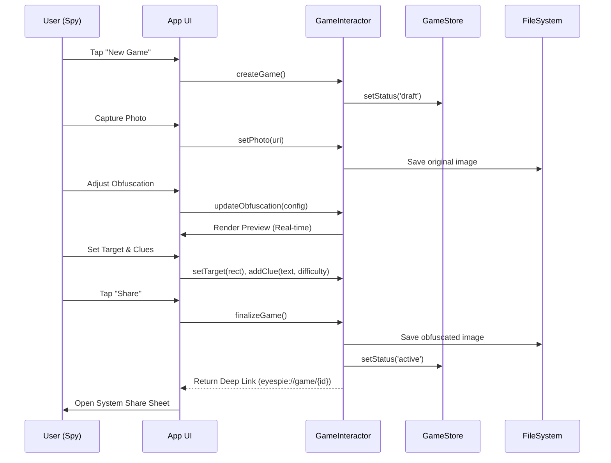
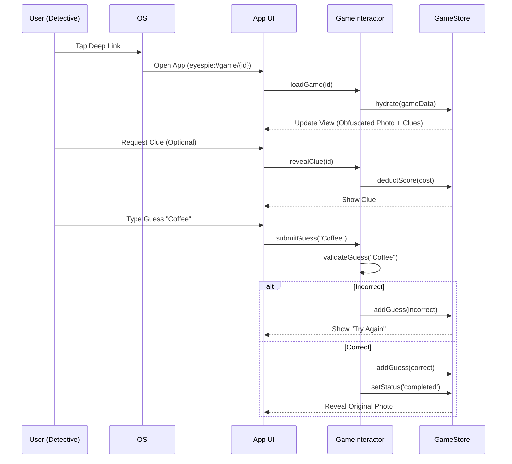

# Eyespie Data Design

## 1. Data Models

These TypeScript interfaces define the shape of the data used throughout the application.

```typescript
// Core Types

type UUID = string;
type URL = string;
type Timestamp = number; // Unix epoch

// Entities

interface Entity {
  id: UUID;
}

interface Player extends Entity {
  name: string; // e.g., "Guest 123" or "Ryjen"
  isGuest: boolean;
}

interface Photo extends Entity {
  originalUrl: URL; // Local file URI or Remote URL
  width: number;
  height: number;
}

interface ObfuscationConfig {
  method: 'blur' | 'pixelate';
  intensity: number; // 0.0 to 1.0
}

interface Clue extends Entity {
  text: string;
  difficulty: 'hard' | 'medium' | 'easy';
  cost: number; // Points deducted for using this clue
}

interface Game extends Entity {
  status: 'draft' | 'active' | 'completed';
  
  // Spy Data
  spyId: UUID;
  photo: Photo;
  obfuscatedPhotoUrl: URL;
  obfuscationConfig: ObfuscationConfig;
  targetRegion: { x: number; y: number; width: number; height: number }; // Normalized 0-1
  clues: Clue[];
  
  // Detective Data
  detectiveId?: UUID; // Nullable until joined
  guesses: Guess[];
  score: number; // Calculated based on clues used and guesses
  
  // Metadata
  createdAt: Timestamp;
  completedAt?: Timestamp;
}

interface Guess extends Entity {
  playerId: UUID;
  text: string;
  isCorrect: boolean;
  similarityScore: number; // 0.0 to 1.0
  timestamp: Timestamp;
}
```

## 2. Data Flow

### Flow 1: Game Creation (The Spy)



### Flow 2: Gameplay (The Detective)


