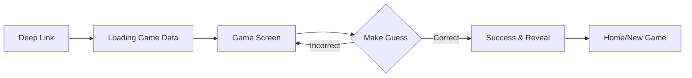

# Eyespie Requirements

## 1. Nouns (Data Models)

These entities represent the core data structures of the application.

*   **Game**: The container for a single round of play. Tracks status (active, completed), participants, and the target subject.
*   **Player**: A user in the system. Can be a *Spy* (creator) or a *Detective* (guesser).
*   **Photo**: The source image captured by the Spy. Contains metadata (location, time) and the image blob.
*   **Obfuscation**: The layer applied to the photo to hide the subject.
    *   *MVP*: Blur, Pixelate.
    *   *Future*: AI-generated imagery.
*   **Clue**: A text hint provided by the Spy.
*   **Guess**: A text attempt made by the Detective to identify the subject.
*   **Result**: The outcome of a guess.
    *   *MVP*: Binary (Correct/Incorrect).
    *   *Future*: Score based on difficulty, speed, location, etc.

## 2. Verbs (Features)

These actions define the functionality available to users.

### Core Gameplay (MVP)
*   **Capture**: The Spy takes a photo using the device camera.
*   **Obfuscate**: The Spy applies blur or pixelation to conceal the target.
*   **Annotate**: The Spy marks the specific region of interest (ROI).
*   **Share**: The Spy generates a deep link to share via the mobile system share sheet (Async).
*   **Join**: A Detective enters the game via a deep link.
*   **Guess**: The Detective submits a text input.
*   **Verify**: The system checks for an exact or fuzzy string match.
*   **Reveal**: The system removes obfuscation upon success.

### Roadmap (Future)
*   **Real-time Sync**: Bluetooth/NFC for private local play between travelers.
*   **Geofencing**: Location-based unlocking or scoring.
*   **Notifications**: Push alerts for game updates.
*   **Social Graph**: Friend lists, game history, leaderboards.
*   **AI Clues**: Generative AI creating visual or textual clues.

## 3. User Personas

### The Spy (Creator)
*   **Motivation**: Wants to challenge friends, show off creativity, or share a funny moment.
*   **Behavior**: Takes photos of everyday objects from weird angles, uses maximum blur, writes cryptic clues.
*   **Goals**: Create a puzzle that is "hard but fair".

### The Detective (Guesser)
*   **Motivation**: Loves puzzles, competitive, wants the dopamine hit of solving a mystery.
*   **Behavior**: Zooms in on pixels, asks for more clues, spams guesses.
*   **Goals**: Solve the puzzle as fast as possible.

## 4. Use Cases

### UC-01: Create New Game (MVP)
1.  **Spy** opens app and taps "New Game".
2.  **Spy** captures a photo.
3.  **Spy** highlights the target and applies pixelation.
4.  **Spy** adds a text clue.
5.  **Spy** taps "Share" and sends the link via iMessage/WhatsApp.

### UC-02: Solve Puzzle (MVP)
1.  **Detective** taps the deep link.
2.  **Detective** sees the obfuscated image and clue.
3.  **Detective** types a guess.
4.  **System** validates the guess (Binary: Yes/No).
5.  **System** reveals the image if correct.

## 5. UX Flows

### Spy Flow (Creation)
```mermaid
graph LR
    A[Home] --> B[Camera]
    B --> C[Preview & Retake]
    C --> D[Obfuscation (Blur/Pixel)]
    D --> E[Target Selection]
    E --> F[Clue Input]
    F --> G[System Share Sheet]
```

### Detective Flow (Gameplay)

